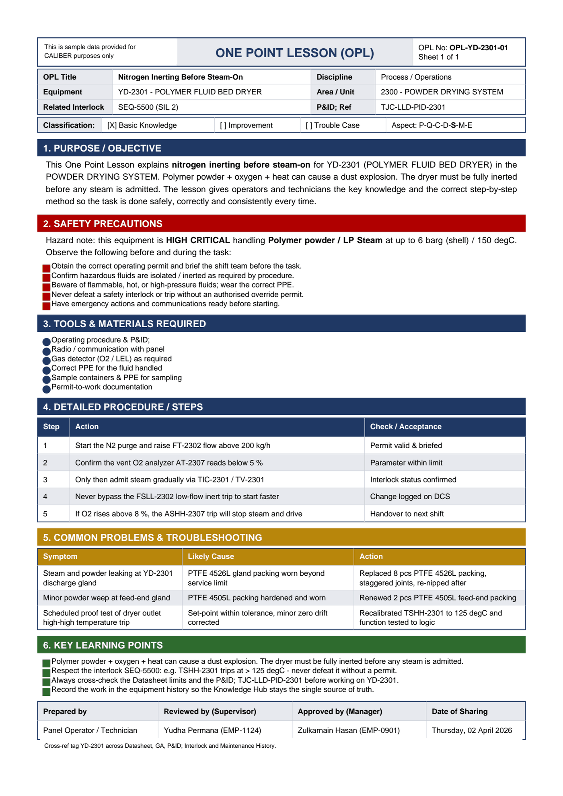

# OPL-YD-2301-01 - Nitrogen Inerting Before Steam-On

| Field | Value |
|---|---|
| Equipment | YD-2301 - POLYMER FLUID BED DRYER |
| Area / unit | 2300 - POWDER DRYING SYSTEM |
| Discipline | Process / Operations |
| Classification | Basic Knowledge |
| Related interlock | SEQ-5500 (SIL 2) |
| P&ID ref | TJC-LLD-PID-2301 |

## 1. Purpose

This One Point Lesson explains nitrogen inerting before steam-on for YD-2301 (POLYMER FLUID BED DRYER) in the POWDER DRYING SYSTEM. Polymer powder + oxygen + heat can cause a dust explosion. The dryer must be fully inerted before any steam is admitted. The lesson gives operators and technicians the key knowledge and the correct step-by-step method so the task is done safely, correctly and consistently every time.

## 2. Safety precautions

Hazard note: this equipment is HIGH CRITICAL handling Polymer powder / LP Steam at up to 6 barg (shell) / 150 degC.

- Obtain the correct operating permit and brief the shift team before the task.
- Confirm hazardous fluids are isolated / inerted as required by procedure.
- Beware of flammable, hot, or high-pressure fluids; wear the correct PPE.
- Never defeat a safety interlock or trip without an authorised override permit.
- Have emergency actions and communications ready before starting.

## 3. Tools & materials

- Operating procedure & P&ID
- Radio / communication with panel
- Gas detector (O2 / LEL) as required
- Correct PPE for the fluid handled
- Sample containers & PPE for sampling
- Permit-to-work documentation

## 4. Procedure

| Step | Action | Check / acceptance (as printed) |
|---|---|---|
| 1 | Start the N2 purge and raise FT-2302 flow above 200 kg/h | Permit valid & briefed |
| 2 | Confirm the vent O2 analyzer AT-2307 reads below 5 % | Parameter within limit |
| 3 | Only then admit steam gradually via TIC-2301 / TV-2301 | Interlock status confirmed |
| 4 | Never bypass the FSLL-2302 low-flow inert trip to start faster | Change logged on DCS |
| 5 | If O2 rises above 8 %, the ASHH-2307 trip will stop steam and drive | Handover to next shift |

## 5. Common problems & troubleshooting

Full text restored from the linked work order where the OPL cell was cut off.

| Symptom | Likely cause | Action | Work order |
|---|---|---|---|
| Steam and powder leaking at YD-2301 discharge gland | PTFE 4526L gland packing worn beyond service limit | Replaced 8 pcs PTFE 4526L packing, staggered joints, re-nipped after warm-up | WO-240028 |
| Minor powder weep at feed-end gland | PTFE 4505L packing hardened and worn | Renewed 2 pcs PTFE 4505L feed-end packing | WO-240029 |
| Scheduled proof test of dryer outlet high-high temperature trip | Set-point within tolerance, minor zero drift corrected | Recalibrated TSHH-2301 to 125 degC and function tested to logic | WO-240030 |

## 6. Key learning points

- Polymer powder + oxygen + heat can cause a dust explosion. The dryer must be fully inerted before any steam is admitted.
- Respect the interlock SEQ-5500: e.g. TSHH-2301 trips at > 125 degC - never defeat it without a permit.
- Always cross-check the Datasheet limits and the P&ID TJC-LLD-PID-2301 before working on YD-2301.
- Record the work in the equipment history so the Knowledge Hub stays the single source of truth.

## Sign-off

| Role | Name |
|---|---|
| Prepared by | Panel Operator / Technician |
| Reviewed by (Supervisor) | Yudha Permana (EMP-1124) |
| Approved by (Manager) | Zulkarnain Hasan (EMP-0901) |
| Date of Sharing | Thursday, 02 April 2026 |

---
Source: `Set_02_YD-2301_POLYMER_FLUID_BED_DRYER/One Point Lesson/OPL-YD-2301-01 - Nitrogen_Inerting_Before_Steam_On.pdf`

## Image

