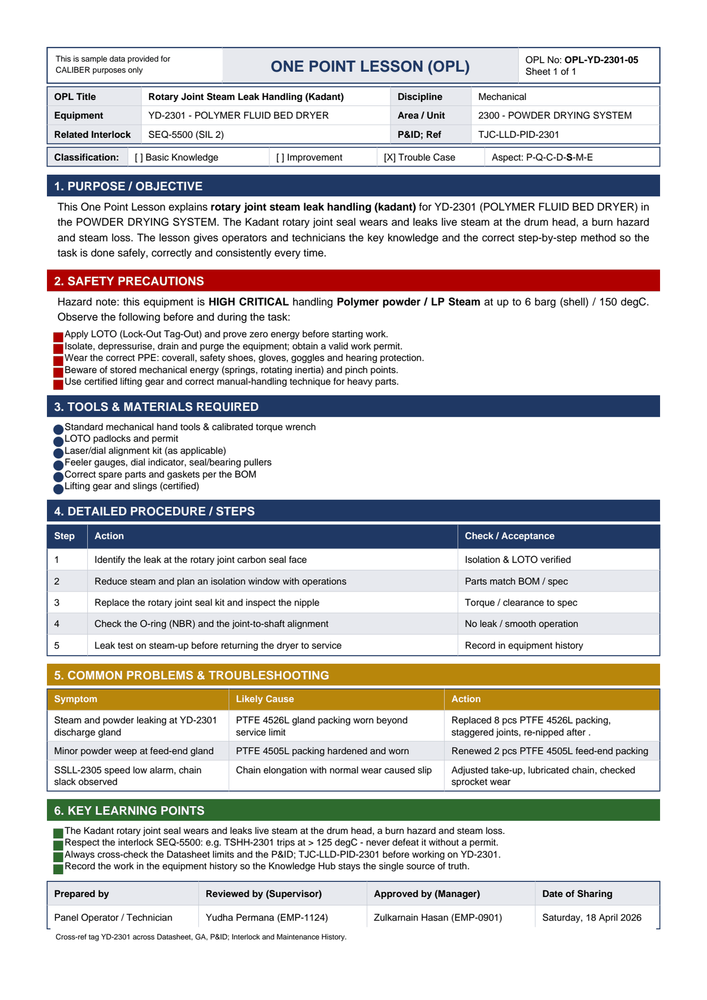

# OPL-YD-2301-05 - Rotary Joint Steam Leak Handling (Kadant)

| Field | Value |
|---|---|
| Equipment | YD-2301 - POLYMER FLUID BED DRYER |
| Area / unit | 2300 - POWDER DRYING SYSTEM |
| Discipline | Mechanical |
| Classification | Trouble Case |
| Related interlock | SEQ-5500 (SIL 2) |
| P&ID ref | TJC-LLD-PID-2301 |

## 1. Purpose

This One Point Lesson explains rotary joint steam leak handling (kadant) for YD-2301 (POLYMER FLUID BED DRYER) in the POWDER DRYING SYSTEM. The Kadant rotary joint seal wears and leaks live steam at the drum head, a burn hazard and steam loss. The lesson gives operators and technicians the key knowledge and the correct step-by-step method so the task is done safely, correctly and consistently every time.

## 2. Safety precautions

Hazard note: this equipment is HIGH CRITICAL handling Polymer powder / LP Steam at up to 6 barg (shell) / 150 degC.

- Apply LOTO (Lock-Out Tag-Out) and prove zero energy before starting work.
- Isolate, depressurise, drain and purge the equipment; obtain a valid work permit.
- Wear the correct PPE: coverall, safety shoes, gloves, goggles and hearing protection.
- Beware of stored mechanical energy (springs, rotating inertia) and pinch points.
- Use certified lifting gear and correct manual-handling technique for heavy parts.

## 3. Tools & materials

- Standard mechanical hand tools & calibrated torque wrench
- LOTO padlocks and permit
- Laser/dial alignment kit (as applicable)
- Feeler gauges, dial indicator, seal/bearing pullers
- Correct spare parts and gaskets per the BOM
- Lifting gear and slings (certified)

## 4. Procedure

| Step | Action | Check / acceptance (as printed) |
|---|---|---|
| 1 | Identify the leak at the rotary joint carbon seal face | Isolation & LOTO verified |
| 2 | Reduce steam and plan an isolation window with operations | Parts match BOM / spec |
| 3 | Replace the rotary joint seal kit and inspect the nipple | Torque / clearance to spec |
| 4 | Check the O-ring (NBR) and the joint-to-shaft alignment | No leak / smooth operation |
| 5 | Leak test on steam-up before returning the dryer to service | Record in equipment history |

## 5. Common problems & troubleshooting

Full text restored from the linked work order where the OPL cell was cut off.

| Symptom | Likely cause | Action | Work order |
|---|---|---|---|
| Steam and powder leaking at YD-2301 discharge gland | PTFE 4526L gland packing worn beyond service limit | Replaced 8 pcs PTFE 4526L packing, staggered joints, re-nipped after warm-up | WO-240028 |
| Minor powder weep at feed-end gland | PTFE 4505L packing hardened and worn | Renewed 2 pcs PTFE 4505L feed-end packing | WO-240029 |
| SSLL-2305 speed low alarm, chain slack observed | Chain elongation with normal wear caused slip | Adjusted take-up, lubricated chain, checked sprocket wear | WO-240031 |

## 6. Key learning points

- The Kadant rotary joint seal wears and leaks live steam at the drum head, a burn hazard and steam loss.
- Respect the interlock SEQ-5500: e.g. TSHH-2301 trips at > 125 degC - never defeat it without a permit.
- Always cross-check the Datasheet limits and the P&ID TJC-LLD-PID-2301 before working on YD-2301.
- Record the work in the equipment history so the Knowledge Hub stays the single source of truth.

## Sign-off

| Role | Name |
|---|---|
| Prepared by | Panel Operator / Technician |
| Reviewed by (Supervisor) | Yudha Permana (EMP-1124) |
| Approved by (Manager) | Zulkarnain Hasan (EMP-0901) |
| Date of Sharing | Saturday, 18 April 2026 |

---
Source: `Set_02_YD-2301_POLYMER_FLUID_BED_DRYER/One Point Lesson/OPL-YD-2301-05 - Rotary_Joint_Steam_Leak_Handling_Kadant.pdf`

## Image

