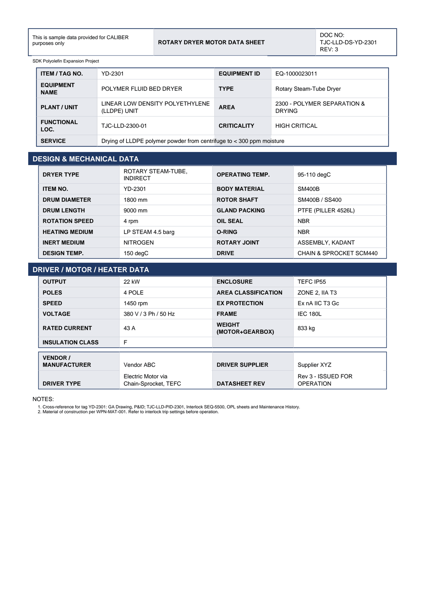

# Equipment Datasheet - YD-2301

Rotary Dryer Motor Data Sheet for **YD-2301 POLYMER FLUID BED DRYER**.

## Identification

| Field | Value |
|---|---|
| ITEM / TAG NO. | YD-2301 |
| EQUIPMENT ID | EQ-1000023011 |
| EQUIPMENT NAME | POLYMER FLUID BED DRYER |
| TYPE | Rotary Steam-Tube Dryer |
| PLANT / UNIT | LINEAR LOW DENSITY POLYETHYLENE (LLDPE) UNIT |
| AREA | 2300 - POLYMER SEPARATION & DRYING |
| FUNCTIONAL LOC. | TJC-LLD-2300-01 |
| CRITICALITY | HIGH CRITICAL |
| SERVICE | Drying of LLDPE polymer powder from centr ifuge to < 300 ppm moi sture |

## Design & Mechanical Data

| Field | Value |
|---|---|
| DRYER TYPE | ROTARY STEAM-TUBE, INDIRECT |
| OPERATING TEMP. | 95-110 degC |
| ITEM NO. | YD-2301 |
| BODY MATERIAL | SM400B |
| DRUM DIAMETER | 1800 mm |
| ROTOR SHAFT | SM400B / SS400 |
| DRUM LENGTH | 9000 mm |
| GLAND PACKING | PTFE (PILLER 4526L) |
| ROTATION SPEED | 4 rpm |
| OIL SEAL | NBR |
| HEATING MEDIUM | LP STEAM 4.5 barg |
| O-RING | NBR |
| INERT MEDIUM | NITROGEN |
| ROTARY JOINT | ASSEMBLY, KADANT |
| DESIGN TEMP. | 150 degC |
| DRIVE | CHAIN & SPROCKET SCM440 |

## Driver / Motor / Heater Data

| Field | Value |
|---|---|
| OUTPUT | 22 kW |
| ENCLOSURE | TEFC IP55 |
| POLES | 4 POLE |
| AREA CLASSIFICATION | ZONE 2, IIA T3 |
| SPEED | 1450 rpm |
| EX PROTECTION | Ex nA IIC T3 Gc |
| VOLTAGE | 380 V / 3 Ph / 50 Hz |
| FRAME | IEC 180L |
| RATED CURRENT | 43 A |
| WEIGHT (MOTOR+GEARBOX) | 833 kg |
| INSULATION CLASS | F |

## Vendor & revision

| Field | Value |
|---|---|
| VENDOR / MANUFACTURER |  |
| DRIVER SUPPLIER | Supplier XYZ |
| DRIVER TYPE | Electric Motor via Chain-Sprocket, TEFC |
| DATASHEET REV | Rev 3 - ISSUED FOR OPERATION |

## Notes

- Cross-reference for tag YD-2301: GA Drawing, P&ID TJC-LLD-PID-2301, Interlock SEQ-5500, OPL sheets and Maintenance History.
- Material of construction per WPN-MAT-001. Refer to interlock trip settings before operation.

---
Source: `Set_02_YD-2301_POLYMER_FLUID_BED_DRYER/Equipment Datasheet - YD-2301.pdf`

## Image

