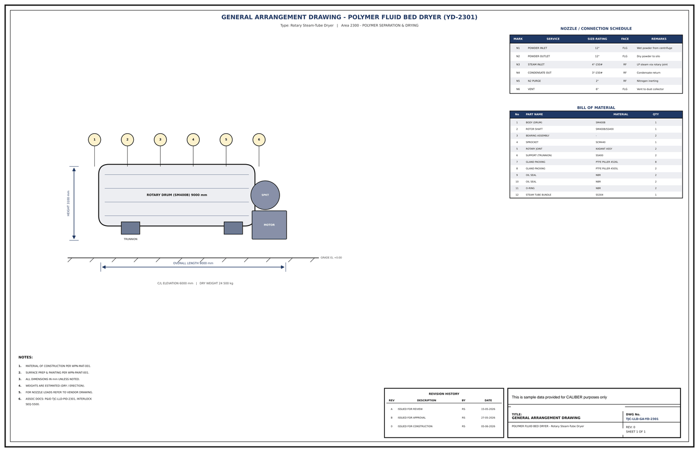

# General Arrangement Drawing - YD-2301

## Key dimensions

- OVERALL LENGTH 9000 mm
- HEIGHT 3100 mm
- C/L ELEVATION 6000 mm   |   DRY WEIGHT 24 500 kg

## Nozzle / connection schedule

Mark, service, size-rating, face, remarks as printed on the drawing.

- N1 POWDER INLET 12" FLG Wet powder from centrifuge
- N2 POWDER OUTLET 12" FLG Dry powder to silo
- N3 STEAM INLET 4"-150# RF LP steam via rotary joint
- N4 CONDENSATE OUT 3"-150# RF Condensate return
- N5 N2 PURGE 2" RF Nitrogen inerting
- N6 VENT 6" FLG Vent to dust collector

## Bill of material

No., part name, material, quantity as printed on the drawing.

- 1 BODY (DRUM) SM400B 1
- 2 ROTOR SHAFT SM400B/SS400 1
- 3 BEARING ASSEMBLY - 2
- 4 SPROCKET SCM440 1
- 5 ROTARY JOINT KADANT ASSY 2
- 6 SUPPORT (TRUNNION) SS400 2
- 7 GLAND PACKING PTFE PILLER 4526L 8
- 8 GLAND PACKING PTFE PILLER 4505L 2
- 9 OIL SEAL NBR 2
- 10 OIL SEAL NBR 2
- 11 O-RING NBR 2

## Notes

- MATERIAL OF CONSTRUCTION PER WPN-MAT-001.
- SURFACE PREP & PAINTING PER WPN-PAINT-001.
- ALL DIMENSIONS IN mm UNLESS NOTED.
- WEIGHTS ARE ESTIMATED (DRY / ERECTION).
- FOR NOZZLE LOADS REFER TO VENDOR DRAWING.
- ASSOC DOCS: P&ID TJC-LLD-PID-2301, INTERLOCK

## Revision history

| Rev | Description | By | Date |
|---|---|---|---|
| A | ISSUED FOR REVIEW | RS | 15-05-2026 |
| B | ISSUED FOR APPROVAL | RS | 27-05-2026 |
| 0 | ISSUED FOR CONSTRUCTION | RS | 05-06-2026 |

---
Source: `Set_02_YD-2301_POLYMER_FLUID_BED_DRYER/Equipment GA Drawing - YD-2301.pdf`

## Image

