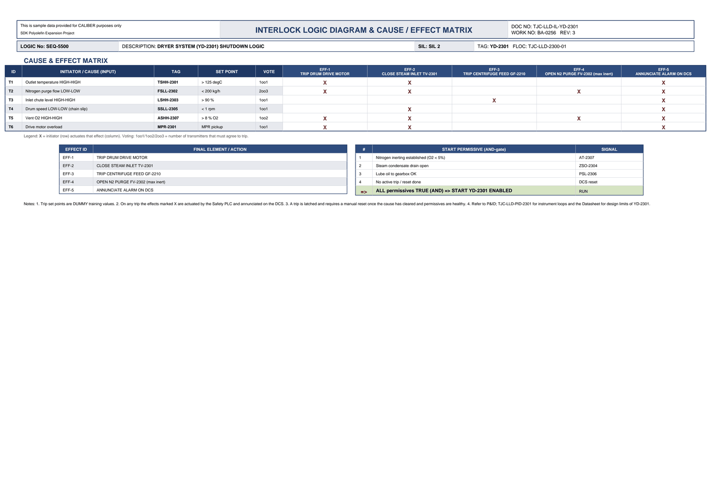

# Interlock Logic & Cause/Effect - YD-2301

| Field | Value |
|---|---|
| Logic no. | SEQ-5500 |
| Description | DRYER SYSTEM (YD-2301) SHUTDOWN LOGIC |
| SIL | SIL 2 |
| Functional location | TJC-LLD-2300-01 |

## Cause & effect matrix

| ID | INITIATOR / CAUSE (INPUT) | TAG | SET POINT | VOTE | EFF-1 TRIP DRUM DRIVE MOTOR | EFF-2 CLOSE STEAM INLET TV-2301 | EFF-3 TRIP CENTRIFUGE FEED GF-2210 | EFF-4 OPEN N2 PURGE FV-2302 (max inert) | EFF-5 ANNUNCIATE ALARM ON DCS |
|---|---|---|---|---|---|---|---|---|---|
| T1 | Outlet temperature HIGH-HIGH | TSHH-2301 | > 125 degC | 1oo1 | X | X |  |  | X |
| T2 | Nitrogen purge flow LOW-LOW | FSLL-2302 | < 200 kg/h | 2oo3 | X | X |  | X | X |
| T3 | Inlet chute level HIGH-HIGH | LSHH-2303 | > 90 % | 1oo1 |  |  | X |  | X |
| T4 | Drum speed LOW-LOW (chain slip) | SSLL-2305 | < 1 rpm | 1oo1 |  | X |  |  | X |
| T5 | Vent O2 HIGH-HIGH | ASHH-2307 | > 8 % O2 | 1oo2 | X | X |  | X | X |
| T6 | Drive motor overload | MPR-2301 | MPR pickup | 1oo1 | X | X |  |  | X |

### Trips in plain language

- **TSHH-2301** (Outlet temperature HIGH-HIGH) trips at **> 125 degC**, voting 1oo1. Effects: TRIP DRUM DRIVE MOTOR; CLOSE STEAM INLET TV-2301; ANNUNCIATE ALARM ON DCS.
- **FSLL-2302** (Nitrogen purge flow LOW-LOW) trips at **< 200 kg/h**, voting 2oo3. Effects: TRIP DRUM DRIVE MOTOR; CLOSE STEAM INLET TV-2301; OPEN N2 PURGE FV-2302 (max inert); ANNUNCIATE ALARM ON DCS.
- **LSHH-2303** (Inlet chute level HIGH-HIGH) trips at **> 90 %**, voting 1oo1. Effects: TRIP CENTRIFUGE FEED GF-2210; ANNUNCIATE ALARM ON DCS.
- **SSLL-2305** (Drum speed LOW-LOW (chain slip)) trips at **< 1 rpm**, voting 1oo1. Effects: CLOSE STEAM INLET TV-2301; ANNUNCIATE ALARM ON DCS.
- **ASHH-2307** (Vent O2 HIGH-HIGH) trips at **> 8 % O2**, voting 1oo2. Effects: TRIP DRUM DRIVE MOTOR; CLOSE STEAM INLET TV-2301; OPEN N2 PURGE FV-2302 (max inert); ANNUNCIATE ALARM ON DCS.
- **MPR-2301** (Drive motor overload) trips at **MPR pickup**, voting 1oo1. Effects: TRIP DRUM DRIVE MOTOR; CLOSE STEAM INLET TV-2301; ANNUNCIATE ALARM ON DCS.

## Effects (final elements)

| EFFECT ID | FINAL ELEMENT / ACTION |
|---|---|
| EFF-1 | TRIP DRUM DRIVE MOTOR |
| EFF-2 | CLOSE STEAM INLET TV-2301 |
| EFF-3 | TRIP CENTRIFUGE FEED GF-2210 |
| EFF-4 | OPEN N2 PURGE FV-2302 (max inert) |
| EFF-5 | ANNUNCIATE ALARM ON DCS |

## Start permissives (all must be true)

| # | START PERMISSIVE (AND-gate) | SIGNAL |
|---|---|---|
| 1 | Nitrogen inerting established (O2 < 5%) | AT-2307 |
| 2 | Steam condensate drain open | ZSO-2304 |
| 3 | Lube oil to gearbox OK | PSL-2306 |
| 4 | No active trip / reset done | DCS reset |
| => | ALL permissives TRUE (AND) => START YD-2301 ENABLED | RUN |

## Notes

- A trip is latched and requires a manual reset once the cause has cleared and permissives are healthy.
- Refer to P&ID TJC-LLD-PID-2301 for instrument loops and the Datasheet for design limits of YD-2301. 

---
Source: `Set_02_YD-2301_POLYMER_FLUID_BED_DRYER/Interlock Logic Diagram - YD-2301.pdf`

## Image

