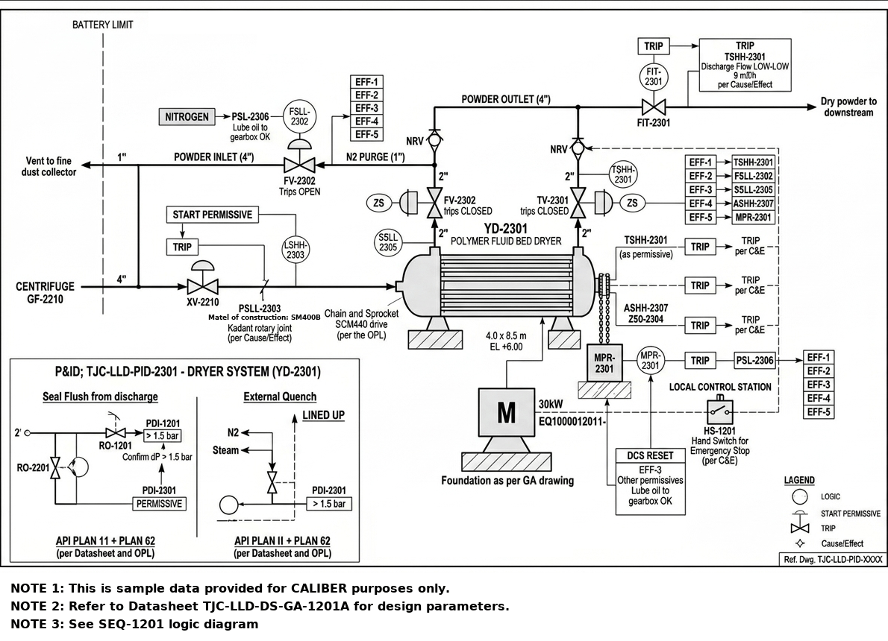

# P&ID - YD-2301

Image-only drawing. The title block prints `TJC-LLD-PID-XXXX`; the number `TJC-LLD-PID-2301` comes from the datasheet and interlock cross-references.

## Tags linked to this drawing

From the interlock matrix and datasheet of YD-2301:

- `ASHH-2307`
- `AT-2307`
- `FSLL-2302`
- `FT-2302`
- `FV-2302`
- `LSHH-2303`
- `MPR-2301`
- `MT-2306`
- `PSL-2306`
- `PT-2304`
- `SSLL-2305`
- `TIC-2301`
- `TSHH-2301`
- `TV-2301`
- `ZSO-2304`

## Description

To be written by an engineer from the drawing (flow path, valves, instruments, trips). Keep tags in backticks so they link.

---
Source: `Set_02_YD-2301_POLYMER_FLUID_BED_DRYER/P&ID_Set_02.png`

## Image

